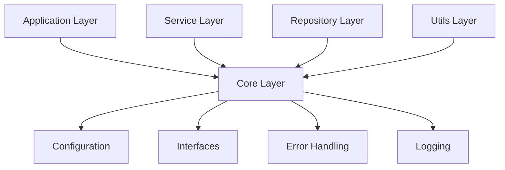

# VVPay Architecture Documentation

## Project Overview
VVPay is a PDF invoice processing system that uses LLM for data extraction and validation. The project follows a clean architecture pattern with clear separation of concerns.

## Project Structure 
ascii
vvpay/
├── app/ # Presentation Layer
│ ├── init.py
│ ├── pages/ # Streamlit pages
│ └── components/ # UI components
│
├── core/ # Core Components
│ ├── init.py
│ ├── config.py # Settings and constants
│ ├── exceptions.py # Error handling
│ ├── logging.py # Logging configuration
│ └── interfaces/ # Abstract interfaces
│ ├── init.py
│ ├── base.py # Base interfaces
│ ├── repository.py # Repository interfaces
│ └── service.py # Service interfaces
│
├── models/ # Domain Models
│ ├── init.py
│ ├── db/ # Database Models
│ │ ├── init.py
│ │ ├── base.py # Base DB model
│ │ ├── meta.py # Meta table model
│ │ ├── extraction.py
│ │ ├── validation.py
│ │ ├── payment.py
│ │ └─��� logs.py
│ ├── service/ # Service Models
│ │ ├── init.py
│ │ ├── enums.py # Enumerations
│ │ └── base.py # Service models
│ └── processing/ # Processing Models
│ ├── init.py
│ ├── base.py # Base processing
│ ├── states.py # State management
│ └── llm.py # LLM models
│
├── repositories/ # Data Access Layer
│ ├── __init__.py          # Package exports
│ ├── base.py             # Base repository implementation
│ ├── mixins.py           # Repository mixins (transactions, etc.)
│ ├── extraction.py       # PDF extraction repository
│ ├── meta.py            # Meta table repository
│ ├── payment.py         # Payment records repository
│ ├── validation.py      # Validation results repository
│ └── logs.py            # Processing logs repository
│
├── services/ # Business Logic Layer
│ ├── init.py
│ ├── document_processor.py
│ ├── validation_service.py
│ └── payment_service.py
│
└── utils/ # Utility Functions
├── init.py
├── db_utils.py # Database utilities
├── validators.py # Data validators
└── helpers.py # Helper functions


## Layer Details

### Core Layer (`core/`)
Contains fundamental components used across the application:
- **config.py**: Application settings, constants, and environment configuration
- **exceptions.py**: Custom exception classes and error handling
- **logging.py**: Logging configuration and utilities
- **interfaces/**: Abstract base classes defining contracts for the application

### Models Layer (`models/`)
Domain models representing the application's data structures:
- **db/**: Database models matching Supabase schema
- **service/**: Models used in business logic
- **processing/**: Models for LLM and processing workflows

### Repositories Layer (`repositories/`)
Data access layer implementing the Repository pattern:
- **base.py**: Generic CRUD operations
- Specific repositories for each domain entity
- Transaction handling and data persistence

### Services Layer (`services/`)
Business logic implementation:
- Document processing with LLM
- Validation logic
- Payment processing
- Business rules enforcement

### Utils Layer (`utils/`)
Utility functions and helpers:
- Database connection utilities
- Common validators
- Helper functions
- Shared tools

## Key Concepts

### 1. Clean Architecture
- Clear separation of concerns
- Dependencies point inward
- Domain models at the center
- External concerns at the edges

### 2. Repository Pattern
- Data access abstraction
- Domain-driven design
- Transaction management
- Error handling

### 3. Interface-Driven Development
- Clear contracts through interfaces
- Dependency inversion
- Testable components
- Loose coupling

### 4. State Management
- LangGraph for workflow states
- Immutable state transitions
- Clear state tracking
- Error recovery

## Development Guidelines

### 1. Adding New Features
1. Define models in appropriate category
2. Create/update interfaces if needed
3. Implement repository if data persistence needed
4. Implement service logic
5. Add presentation layer components

### 2. Error Handling
- Use custom exceptions from `core.exceptions`
- Proper error logging
- Error recovery where possible
- Clear error messages

### 3. Database Operations
- Always use repositories
- Proper transaction handling
- Error handling and logging
- Data validation

### 4. Testing
- Unit tests for services
- Repository tests
- Integration tests
- LLM workflow tests

## Best Practices

1. **Code Organization**
   - Follow the defined structure
   - Keep concerns separated
   - Use proper imports
   - Document complex logic

2. **Error Handling**
   - Use custom exceptions
   - Proper logging
   - Error recovery
   - User feedback

3. **State Management**
   - Immutable states
   - Clear transitions
   - Error states
   - State logging

4. **Documentation**
   - Clear docstrings
   - Type hints
   - Complex logic explanation
   - API documentation

## Configuration

The application uses environment variables for configuration:

## Configuration

The application uses environment variables for configuration:


## Getting Started

1. Clone the repository
2. Set up virtual environment
3. Install dependencies
4. Configure environment variables
5. Run database migrations
6. Start the application

For more details on specific components or workflows, refer to their respective documentation files.

## Core Layer Details

### Configuration Management (`core/config.py`)
- **Settings Management**
  - Environment variables validation
  - Type-safe configuration
  - Default values
  - Directory structure management
  - Cached settings instance
  - Application constants

- **Configuration Categories**
  ```python
  # Example configuration structure
  class Settings(BaseSettings):
      # Project Configuration
      PROJECT_NAME: str
      VERSION: str
      
      # Database Configuration
      SUPABASE_URL: str
      SUPABASE_KEY: str
      
      # API Configuration
      OPENAI_API_KEY: str
      
      # Processing Configuration
      MODEL_NAME: str
      MODEL_TEMPERATURE: float
  ```

### Interface Architecture (`core/interfaces/`)
- **Base Interfaces**
  - Common interface methods
  - Type safety with generics
  - Abstract method definitions

- **Interface Categories**
  1. **Repository Interfaces**
     - CRUD operations
     - Transaction handling
     - Query specifications
  
  2. **Service Interfaces**
     - Business operations
     - Processing workflows
     - Validation rules
  
  3. **Processing Interfaces**
     - Document processing
     - LLM interactions
     - State management

### Error Handling (`core/exceptions.py`)
- **Exception Hierarchy**
  ```
  BaseVPayError
  ├── DatabaseError
  ├── PDFError
  ├── ValidationError
  ├── APIError
  └── ExtractionError
  ```

- **Error Components**
  - Error codes
  - Severity levels
  - Detailed messages
  - Error context
  - Stack traces

### Logging System (`core/logging.py`)
- **Logging Features**
  - JSON-formatted logs
  - Rotating file handlers
  - Level-based logging
  - Component-specific loggers
  - Performance metrics

- **Log Categories**
  1. **Error Logs**
     - Critical errors
     - Exception details
     - Stack traces
  
  2. **Application Logs**
     - Business operations
     - Process flows
     - State changes
  
  3. **Debug Logs**
     - Detailed information
     - Development data
     - Performance metrics

### Core Layer Best Practices

1. **Configuration Management**
   - Use environment variables for sensitive data
   - Validate all settings at startup
   - Cache configuration values
   - Use type hints for all settings
   - Provide clear default values

2. **Interface Design**
   - Keep interfaces focused and small
   - Use dependency injection
   - Follow SOLID principles
   - Document all abstract methods
   - Use proper type hints

3. **Error Handling**
   - Create specific exception types
   - Include context in errors
   - Log all exceptions
   - Provide recovery mechanisms
   - Use error codes consistently

4. **Logging**
   - Use structured logging
   - Include relevant context
   - Follow log levels properly
   - Rotate logs regularly
   - Monitor log sizes

### Core Layer Dependencies


### Core Layer Guidelines

1. **Adding New Core Components**
   - Place in appropriate category
   - Follow existing patterns
   - Document thoroughly
   - Consider dependencies
   - Add type hints

2. **Modifying Core Components**
   - Maintain backward compatibility
   - Update documentation
   - Add migration guides
   - Test thoroughly
   - Update dependencies

3. **Core Layer Testing**
   - Unit test all components
   - Test configuration validation
   - Mock external dependencies
   - Test error conditions
   - Verify logging behavior

### Repository Layer (`repositories/`)

#### Structure
```
repositories/
├── __init__.py          # Package exports
├── base.py             # Base repository implementation
├── mixins.py           # Repository mixins (transactions, etc.)
├── extraction.py       # PDF extraction repository
├── meta.py            # Meta table repository
├── payment.py         # Payment records repository
├── validation.py      # Validation results repository
└── logs.py            # Processing logs repository
```

#### Components

1. **Base Repository (`base.py`)**
   - Generic CRUD operations
   - Type-safe with generics
   - Error handling
   - Logging integration
   - Model conversion

2. **Repository Mixins (`mixins.py`)**
   - Transaction support
   - Batch operations
   - Query builders
   - Cache management
   - Audit logging

3. **Domain Repositories**
   - `extraction.py` - PDF processing results
   - `meta.py` - Provider metadata
   - `payment.py` - Payment records
   - `validation.py` - Validation results
   - `logs.py` - System logs

#### Repository Pattern Implementation

1. **Base Repository Features**
```python
class BaseRepository(Generic[T]):
    def get_by_id(self) -> Optional[T]
    def get_all() -> List[T]
    def create(model: T) -> T
    def update(id: UUID, model: T) -> T
```

2. **Transaction Support**
```python
class TransactionMixin:
    def execute_transaction(
        operations: List[Dict],
        rollback_operations: List[Dict]
    ) -> List[Dict]
```

3. **Repository Usage**
```python
# Example repository implementation
class ExtractionRepository(BaseRepository[PDFExtraction], TransactionMixin):
    def __init__(self):
        super().__init__("pdf_extractions", PDFExtraction)
```

#### Best Practices

1. **Repository Design**
   - One repository per domain entity
   - Single responsibility principle
   - Transaction support where needed
   - Proper error handling
   - Comprehensive logging

2. **Data Access**
   - Use type-safe models
   - Validate input/output
   - Handle transactions properly
   - Cache when appropriate
   - Monitor performance

3. **Error Handling**
   - Use custom database exceptions
   - Provide context in errors
   - Log all database operations
   - Include rollback mechanisms
   - Track failed operations

4. **Testing**
   - Unit test all repositories
   - Mock database operations
   - Test transactions
   - Verify rollbacks
   - Test edge cases

#### Repository Guidelines

1. **Creating New Repositories**
   ```python
   class NewEntityRepository(BaseRepository[EntityModel]):
       def __init__(self):
           super().__init__("table_name", EntityModel)
   ```

2. **Adding Custom Methods**
   ```python
   def custom_query(self, params: Dict) -> List[T]:
       # Implement custom query logic
       pass
   ```

3. **Transaction Usage**
   ```python
   def transactional_operation(self, data: T) -> T:
       operations = [{"action": "insert", "data": data}]
       rollbacks = [{"action": "delete", "data": data}]
       return self.execute_transaction(operations, rollbacks)
   ```

#### Integration with Other Layers

1. **Service Layer Integration**
   - Repositories are injected into services
   - Services use repository methods
   - Transaction coordination
   - Error propagation

2. **Model Layer Integration**
   - Strong typing with models
   - Validation on save/update
   - Data transformation
   - Schema compliance

3. **Utility Layer Integration**
   - Database utilities
   - Connection management
   - Query building
   - Performance monitoring