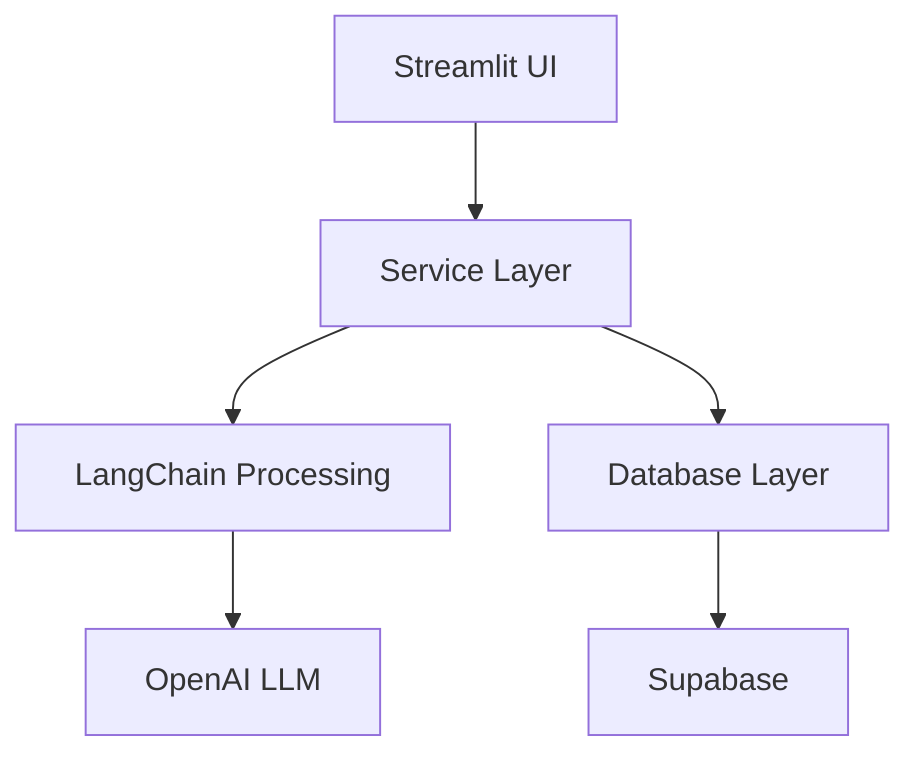

# VVPay - Automated Invoice Processing System

<div align="center">


</div>

## 🌟 Overview

VVPay is a sophisticated invoice processing system that leverages Large Language Models (LLMs) and advanced PDF processing to automate the extraction, validation, and payment processing of invoices. Built with a clean architecture approach, it combines modern technologies like LangChain, Streamlit, and Supabase to deliver a robust and user-friendly solution.

## 🏗️ Architecture



### Core Components

1. **Presentation Layer** (`app/`)
   - Streamlit-based UI
   - Component-based architecture
   - Real-time status updates
   - Interactive validation interface

2. **Service Layer** (`services/`)
   - Document processing with LangGraph
   - Validation logic
   - Payment processing
   - Error handling

3. **Data Layer** (`models/`, `repositories/`)
   - Pydantic models
   - Repository pattern
   - Type-safe operations
   - Database abstractions

4. **Infrastructure** (`core/`)
   - Configuration management
   - Exception handling
   - Logging system
   - Interface definitions

## 🚀 Features

- **PDF Processing**
  - Intelligent text extraction
  - Structure recognition
  - Error recovery
  - Multi-page support

- **LLM Integration**
  - GPT-4 powered extraction
  - Context-aware processing
  - Confidence scoring
  - Validation rules

- **Data Management**
  - Supabase integration
  - Transaction support
  - Audit logging
  - State tracking

## 🛠️ Technology Stack

- **Frontend**: Streamlit
- **Backend**: Python 3.11
- **Database**: Supabase (PostgreSQL)
- **LLM**: OpenAI GPT-4
- **Processing**: LangChain, LangGraph
- **PDF Processing**: PDFMiner
- **Data Validation**: Pydantic

## 📦 Installation

1. Clone the repository:
```bash
git clone https://github.com/yourusername/vvpay.git
cd vvpay
```

2. Create virtual environment:
```bash
python -m venv venv
source venv/bin/activate  # Linux/Mac
venv\Scripts\activate     # Windows
```

3. Install dependencies:
```bash
pip install -r requirements.txt
```

4. Configure environment:
```bash
cp .env.example .env
# Edit .env with your settings
```

## 🔧 Configuration

Required environment variables:
```env
SUPABASE_URL=your_supabase_url
SUPABASE_KEY=your_supabase_key
OPENAI_API_KEY=your_openai_key
MODEL_NAME=gpt-4
```

## 🚦 Usage

1. Start the application:
```bash
streamlit run run.py
```

2. Upload PDF invoices through the UI
3. Monitor processing in Status tab
4. Review and validate in Validation tab

## 🧪 Testing

Run tests with pytest:
```bash
pytest tests/
```

## 📚 Documentation

Detailed documentation available in `doc/` directory:
- [Architecture Overview](doc/ARCHITECTURE.md)
- [Development Guide](doc/DEVELOPMENT.md)
- [API Documentation](doc/API.md)


## 📄 License

This project is licensed under the MIT License - see the [LICENSE](LICENSE) file for details.


---

<div align="center">
Victor von Sohsten
</div>