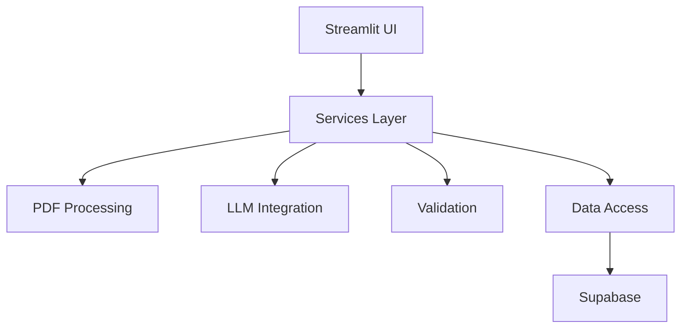
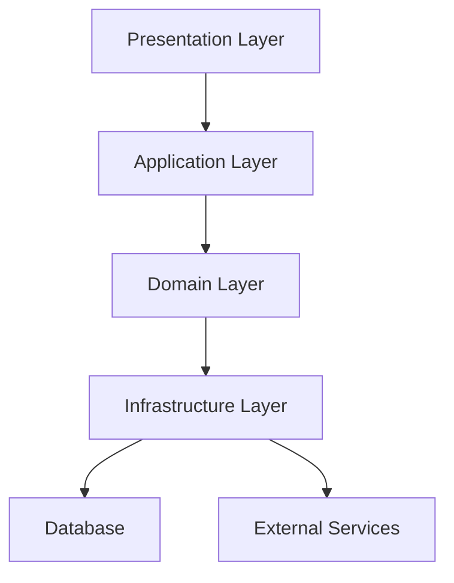
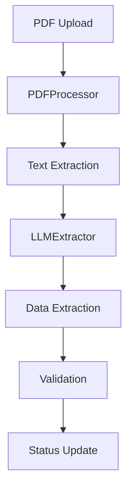

# Project Analysis and Implementation Strategy

## Project Overview

### Current Architecture


### Core Components
1. **Frontend**
   - Streamlit interface
   - File upload handling
   - Status display
   - Error presentation

2. **Service Layer**
   - PDF processing (data_extraction.py)
   - LLM integration (llm_extraction.py)
   - Validation (validation_service.py)

3. **Data Layer**
   - Models (models.py)
   - Repositories
   - Database utilities

4. **Infrastructure**
   - Core utilities
   - Configuration
   - Logging
   - Error handling

## Critical Analysis

### Architectural Issues

1. **Coupling Problems**
   - Tight service dependencies
   - Direct database access
   - Hard-coded configurations
   - Limited abstraction

2. **Performance Concerns**
   - Sequential processing
   - Single database connection
   - No caching strategy
   - Memory inefficiency

3. **Reliability Gaps**
   - Basic error handling
   - Limited retry logic
   - No health checks
   - Missing monitoring

### Technical Debt

1. **Code Structure**
   - Inconsistent patterns
   - Duplicate logic
   - Missing abstractions
   - Limited documentation

2. **Error Handling**
   - Inconsistent approaches
   - Limited recovery
   - Basic logging
   - Missing context

3. **Testing**
   - Limited coverage
   - No integration tests
   - Missing benchmarks
   - Basic validation

## Solution Architecture

### Proposed Structure


### Key Components

1. **Presentation Layer**
```python
class UIManager:
    def __init__(self, service_container: ServiceContainer):
        self.services = service_container
        self.state = SessionState()

    def render_upload(self):
        """Handle file upload with progress"""

    def display_results(self):
        """Show processing results"""
```

2. **Application Layer**
```python
class ProcessingOrchestrator:
    def __init__(self, 
                 pdf_service: PDFService,
                 llm_service: LLMService,
                 validation_service: ValidationService):
        self.pdf_service = pdf_service
        self.llm_service = llm_service
        self.validation_service = validation_service

    async def process_document(self, content: bytes, filename: str):
        """Orchestrate document processing"""
```

3. **Domain Layer**
```python
class DocumentProcessor:
    def __init__(self, repository: Repository):
        self.repository = repository
        self.validator = DocumentValidator()

    async def process(self, document: Document):
        """Process document with domain logic"""
```

4. **Infrastructure Layer**
```python
class ServiceContainer:
    def __init__(self):
        self._services = {}
        self._configs = {}

    def register(self, interface, implementation):
        """Register service implementation"""
```

## Implementation Strategy

### Phase 1: Foundation (Week 1-2)

1. **Service Container**
   - Create dependency injection
   - Define service interfaces
   - Implement registration
   - Add lifecycle management

2. **Configuration**
   - Enhance settings management
   - Add environment validation
   - Implement secrets handling
   - Create config reloading

3. **Error Handling**
   - Implement recovery strategies
   - Add retry policies
   - Create circuit breakers
   - Enhance logging

### Phase 2: Core Services (Week 3-4)

1. **Document Processing**
   - Implement async processing
   - Add batch support
   - Create progress tracking
   - Add validation

2. **LLM Integration**
   - Add model fallbacks
   - Implement caching
   - Add retry logic
   - Enhance prompts

3. **Data Access**
   - Implement connection pooling
   - Add transaction support
   - Create batch operations
   - Add caching

### Phase 3: Enhancement (Week 5-6)

1. **Performance**
   - Optimize database queries
   - Implement caching
   - Add batch processing
   - Memory optimization

2. **Reliability**
   - Add health checks
   - Implement monitoring
   - Enhance error recovery
   - Add metrics

3. **Testing**
   - Add unit tests
   - Create integration tests
   - Implement benchmarks
   - Add stress tests

## Implementation Steps

### Step 1: Service Container
```python
# infrastructure/container.py
class ServiceContainer:
    def __init__(self):
        self._services = {}
        self._configs = {}
        self._initialize_core()

    def _initialize_core(self):
        """Initialize core services"""
        self.register(IConfig, ConfigService())
        self.register(ILogger, LoggingService())
        self.register(IErrorHandler, ErrorHandler())
```

### Step 2: Core Services
```python
# services/base.py
class BaseService:
    def __init__(self, container: ServiceContainer):
        self.config = container.get(IConfig)
        self.logger = container.get(ILogger)
        self.error_handler = container.get(IErrorHandler)

    async def initialize(self):
        """Initialize service"""

    async def shutdown(self):
        """Cleanup service"""
```

### Step 3: Document Processing
```python
# services/document.py
class DocumentService(BaseService):
    def __init__(self, container: ServiceContainer):
        super().__init__(container)
        self.processor = container.get(IDocumentProcessor)
        self.validator = container.get(IValidator)

    async def process_document(self, content: bytes):
        """Process document with error handling"""
        try:
            return await self.processor.process(content)
        except Exception as e:
            return await self.error_handler.handle(e)
```

## Monitoring and Maintenance

### Health Checks
```python
# monitoring/health.py
class HealthCheck:
    def __init__(self, container: ServiceContainer):
        self.services = container.get_all()
        self.metrics = MetricsCollector()

    async def check_health(self):
        """Check system health"""
        results = {}
        for service in self.services:
            results[service.name] = await service.health_check()
        return results
```

### Performance Monitoring
```python
# monitoring/metrics.py
class MetricsCollector:
    def __init__(self):
        self.metrics = {}
        self.alerts = AlertManager()

    async def collect_metrics(self):
        """Collect system metrics"""
        metrics = {
            'cpu': self.get_cpu_usage(),
            'memory': self.get_memory_usage(),
            'disk': self.get_disk_usage(),
            'network': self.get_network_stats()
        }
        await self.alerts.check_thresholds(metrics)
```

# Full Code Review

## models/models.py

### Purpose
Core data models that define the application's data structures and validation rules.

### Direct Dependencies
1. **External Libraries**
   - pydantic: Data validation and settings management
   - datetime: Timestamp handling
   - decimal: Precise decimal calculations
   - re: Regular expressions for validation

### File Relationships
1. **Used By**
   - services/llm_extraction.py
     - Uses LLMOutput for structured extraction
     - Uses PDFExtraction for storage
   
   - services/data_extraction.py
     - Uses PDFExtraction for document processing
     - Uses Status enum for state management
   
   - repositories/extraction.py
     - Uses PDFExtraction for database operations
     - Uses validation rules
   
   - repositories/llm.py
     - Uses LLMOutput for result handling
     - Uses PDFExtraction for updates

2. **Depends On**
   - db.md (schema definitions)
   - core/exceptions.py (validation errors)

### Model Analysis

1. **Enums**
   - PaymentType: Used across multiple models
   - Status: Critical for process flow
   - Missing: PaymentStatus (referenced in __all__ but not defined)
   - Missing: LogLevel (referenced in __all__ but not defined)

2. **Base Models**
   - BaseVPayModel: Underutilized, could be extended to more models
   - Inconsistent usage: Some models use it, others don't

3. **Critical Models**
   
   a. **LLMOutput**
   - Strong validation rules
   - Clear field definitions
   - Potential Improvements:
     - Add confidence scoring
     - Add extraction metadata
     - Add validation context

   b. **PDFExtraction**
   - Matches database schema
   - Comprehensive fields
   - Issues:
     - Inconsistent CNPJ validation with LLMOutput
     - payment_type should use PaymentType enum
     - Could use BaseVPayModel

   c. **ValidationResult**
   - Good relationship definitions
   - Flexible error storage
   - Improvements needed:
     - Add validation types
     - Add severity levels
     - Add validation context

   d. **MetaTable**
   - Strong decimal handling
   - Good validation
   - Concerns:
     - Month-specific fields (ago_*) might limit flexibility
     - Could use BaseVPayModel

   e. **PaymentRecord**
   - Good decimal handling
   - Missing:
     - Payment type validation
     - Status enum
     - Relationship validations

### Known Issues
1. **Consistency Issues**
   - Inconsistent base class usage
   - Mixing Config and model_config
   - Validation rule differences between models

2. **Missing Features**
   - Cross-model validation
   - Relationship enforcement
   - State transition validation
   - Audit trail support

3. **Technical Debt**
   - Duplicate validation logic
   - Inconsistent decimal handling
   - Missing PaymentStatus and LogLevel enums

### Improvement Opportunities

1. **Structural Improvements**
   - Implement consistent base class usage
   - Add model relationships
   - Add state machine for status transitions

2. **Validation Enhancements**
   - Add cross-model validation
   - Standardize validation rules
   - Add validation contexts

3. **Feature Additions**
   - Add audit trail support
   - Add version tracking
   - Add data conversion methods

4. **Documentation Needs**
   - Add field usage examples
   - Document validation rules
   - Add relationship diagrams

### Critical Points for Modifications
1. **High Impact Areas**
   - Status enum changes
   - Validation rule changes
   - Field type changes

2. **Safety Considerations**
   - Maintain backward compatibility
   - Preserve validation rules
   - Consider database constraints

3. **Performance Implications**
   - Validation complexity
   - Model instantiation overhead
   - Serialization impact

### Next Steps Priority
1. **Critical**
   - Add missing enums
   - Standardize base class usage
   - Fix validation inconsistencies

2. **Important**
   - Add relationship validations
   - Improve decimal handling
   - Add state transitions

3. **Nice to Have**
   - Add audit support
   - Add conversion methods
   - Enhance documentation 

# Repository Module Review

## repositories/__init__.py

### Current Status
- Empty file
- Missing module exports
- No documentation

### Improvement Needed
```python
"""Repository module for database operations"""
from .base import BaseRepository
from .extraction import ExtractionRepository
from .llm import LLMRepository

__all__ = [
    'BaseRepository',
    'ExtractionRepository',
    'LLMRepository'
]
```

## repositories/base.py

### Purpose
Base repository class providing common CRUD operations and generic type support.

### Direct Dependencies
1. **Standard Library**
   - typing: Type hints and generics
   - datetime: Timestamp handling

2. **Project Dependencies**
   - core.exceptions: Error handling
   - utils.db_utils: Database operations

### File Relationships
1. **Used By**
   - repositories/extraction.py
   - repositories/llm.py
   - Any future repository implementations

2. **Depends On**
   - utils/db_utils.py (critical dependency)
   - core/exceptions.py (error handling)

### Analysis
1. **Strengths**
   - Generic type support
   - Clean CRUD interface
   - Consistent error handling
   - Dependency injection ready

2. **Issues**
   - Missing select parameter in get_all
   - No batch operations
   - No transaction support
   - Limited query options

3. **Missing Features**
   - Pagination support
   - Sorting options
   - Relationship handling
   - Batch operations
   - Transaction management

### Improvement Opportunities
1. **Feature Additions**
```python
def get_all(
    self,
    filters: Optional[Dict] = None,
    limit: Optional[int] = None,
    select: Optional[str] = "*",
    order_by: Optional[str] = None,
    offset: Optional[int] = None
) -> List[Dict]:
    """Enhanced query support"""
```

2. **Batch Operations**
```python
def batch_create(self, items: List[Dict]) -> List[Dict]:
    """Batch creation support"""
```

3. **Transaction Support**
```python
def with_transaction(self):
    """Transaction context manager"""
```

## repositories/extraction.py

### Purpose
Handles PDF extraction data persistence and status management.

### Direct Dependencies
1. **Project Models**
   - models.PDFExtraction
   - models.Status

2. **Core Utilities**
   - core.exceptions
   - core.logging

### File Relationships
1. **Used By**
   - services/data_extraction.py
   - services/llm_extraction.py

2. **Depends On**
   - repositories/base.py
   - models/models.py

### Analysis
1. **Strengths**
   - Strong error handling
   - Good logging
   - Clear responsibility separation

2. **Issues**
   - Timestamp management could be centralized
   - Status transitions not validated
   - No batch processing support

3. **Missing Features**
   - Status transition validation
   - Batch extraction support
   - Extraction history
   - Cleanup operations

## repositories/llm.py

### Purpose
Manages LLM extraction results and updates.

### Direct Dependencies
1. **Project Models**
   - models.PDFExtraction
   - models.LLMOutput
   - models.Status

2. **Core Utilities**
   - core.exceptions
   - core.logging

### File Relationships
1. **Used By**
   - services/llm_extraction.py

2. **Depends On**
   - repositories/base.py
   - models/models.py

### Analysis
1. **Strengths**
   - Clean update operations
   - Good error handling
   - Clear logging

2. **Issues**
   - Duplicate timestamp logic
   - No result caching
   - No batch processing
   - No retry logic

3. **Missing Features**
   - Result caching
   - Batch updates
   - Performance metrics
   - Cleanup operations

### Critical Points for Repository Module

1. **Consistency Needs**
   - Standardize timestamp handling
   - Unify error handling
   - Consistent logging patterns
   - Common validation approaches

2. **Performance Improvements**
   - Add caching layer
   - Implement batch operations
   - Optimize queries
   - Add connection pooling

3. **Feature Additions**
   - Transaction support
   - Batch operations
   - Query optimization
   - Status management
   - Cleanup routines

4. **Documentation Needs**
   - API documentation
   - Usage examples
   - Error handling guide
   - Performance tips

# Database Utilities Review

## utils/db_utils.py

### Purpose
Core database interaction layer providing standardized access to Supabase operations.

### Direct Dependencies
1. **External Libraries**
   - supabase: Database client
   - postgrest.exceptions: Error handling
   - datetime: Timestamp handling
   - json: Data serialization

2. **Project Dependencies**
   - config.settings: Database configuration
   - core.exceptions: Custom error handling
   - core.logging: Logging system

### File Relationships
1. **Used By**
   - repositories/base.py (Primary consumer)
     - Uses all CRUD operations
     - Depends on error handling
   
   - repositories/extraction.py
     - Uses insert and update operations
     - Relies on error handling
   
   - repositories/llm.py
     - Uses update operations
     - Depends on response handling

2. **Impacts**
   - All database operations
   - Error propagation
   - Performance bottlenecks
   - Data consistency

### Function Analysis

1. **init_supabase()**
   - **Strengths**
     - Connection testing
     - Error handling
     - Logging
   
   - **Issues**
     - No connection pooling
     - No retry mechanism
     - Single connection point
   
   - **Improvements Needed**
     - Add connection pooling
     - Add retry logic
     - Add health checks
     - Add connection recovery

2. **handle_response()**
   - **Strengths**
     - Consistent error handling
     - Null checking
     - Type handling
   
   - **Issues**
     - Limited response type checking
     - No data validation
     - Basic error information
   
   - **Improvements Needed**
     - Add response type validation
     - Enhanced error details
     - Response transformation options

3. **get_records()**
   - **Strengths**
     - Flexible filtering
     - Select support
     - Good logging
   
   - **Issues**
     - No pagination
     - Limited query options
     - Basic filtering
   
   - **Improvements Needed**
     - Add pagination
     - Add sorting
     - Add complex filters
     - Add relation support

4. **insert_record()**
   - **Strengths**
     - Good error handling
     - Timestamp management
     - Clear logging
   
   - **Issues**
     - No batch insert
     - Limited validation
     - No transaction support
   
   - **Improvements Needed**
     - Add batch operations
     - Add validation hooks
     - Add transaction support

5. **update_record() & upsert_record()**
   - **Strengths**
     - Flexible updates
     - Conflict handling
     - Good logging
   
   - **Issues**
     - No optimistic locking
     - No partial updates
     - No batch updates
   
   - **Improvements Needed**
     - Add optimistic locking
     - Add partial updates
     - Add batch operations

### Critical Points

1. **Performance Considerations**
   - Connection management
   - Query optimization
   - Batch operations
   - Response handling

2. **Data Integrity**
   - Transaction support
   - Validation hooks
   - Error recovery
   - Consistency checks

3. **Error Handling**
   - Error classification
   - Recovery strategies
   - Error propagation
   - Logging enhancement

### Improvement Opportunities

1. **Connection Management**
```python
class DatabasePool:
    """Database connection pool"""
    def __init__(self, min_size: int = 1, max_size: int = 10):
        self.connections = []
        self.min_size = min_size
        self.max_size = max_size
```

2. **Transaction Support**
```python
@contextmanager
def transaction():
    """Transaction context manager"""
    try:
        yield
        # commit
    except Exception:
        # rollback
        raise
```

3. **Batch Operations**
```python
def batch_insert(table_name: str, records: List[dict]) -> List[Dict]:
    """Batch insert operation"""
    # Implementation
```

### Next Steps Priority

1. **Critical**
   - Add connection pooling
   - Implement transactions
   - Add batch operations
   - Enhance error recovery

2. **Important**
   - Add query optimization
   - Improve validation
   - Add health checks
   - Enhance logging

3. **Nice to Have**
   - Add caching
   - Add metrics
   - Add documentation
   - Add tests

### Documentation Needs
1. **API Documentation**
   - Function signatures
   - Error handling
   - Examples
   - Best practices

2. **Performance Guide**
   - Query optimization
   - Batch operations
   - Connection management
   - Error handling

3. **Troubleshooting Guide**
   - Common errors
   - Recovery steps
   - Debug tips
   - Performance issues

# Services Module Review

## services/__init__.py

### Current Status
- Empty file
- Missing module exports
- No documentation

### Improvement Needed
```python
"""Services module for business logic and processing"""
from .data_extraction import pdf_processor
from .llm_extraction import llm_extractor
from .validation_service import validation_service

__all__ = [
    'pdf_processor',
    'llm_extractor',
    'validation_service'
]
```

## services/data_extraction.py

### Purpose
Handles PDF document processing and text extraction using LangChain.

### Direct Dependencies
1. **External Libraries**
   - langchain_community.document_loaders: PDF processing
   - langchain.text_splitter: Text chunking

2. **Project Dependencies**
   - models.PDFExtraction: Data model
   - repositories.extraction: Data persistence
   - services.llm_extraction: LLM processing

### Critical Analysis

1. **Strengths**
   - Clean separation of concerns
   - Good error handling
   - Proper resource cleanup
   - Effective logging

2. **Issues**
   - Single file processing only
   - No batch processing
   - Temporary file handling could be improved
   - No retry mechanism

3. **Improvement Opportunities**
   - Add batch processing
   - Implement async processing
   - Add file validation
   - Add progress tracking

## services/llm_extraction.py

### Purpose
Manages LLM-based data extraction using LangChain.

### Direct Dependencies
1. **External Libraries**
   - langchain_openai: LLM integration
   - langchain_core: Chain components

2. **Project Dependencies**
   - models.LLMOutput: Data structure
   - repositories.llm: Data persistence

### Critical Analysis

1. **Strengths**
   - Well-structured chain
   - Good prompt engineering
   - Error handling
   - Fallback mechanism

2. **Issues**
   - Hard-coded model ("gpt-4o-mini")
   - No retry logic
   - No streaming support
   - Limited validation

3. **Improvement Opportunities**
   - Add model fallbacks
   - Implement streaming
   - Add caching
   - Enhance validation

## services/validation_service.py

### Purpose
Validates extracted data against meta_table records.

### Direct Dependencies
1. **Project Dependencies**
   - models: Data models
   - utils.db_utils: Database operations
   - core.exceptions: Error handling

### Critical Analysis

1. **Strengths**
   - Comprehensive validation
   - Good error classification
   - Detailed logging
   - Clear business rules

2. **Issues**
   - Direct database access (bypassing repositories)
   - Hard-coded values (August 2024)
   - Limited batch processing
   - No caching

3. **Improvement Opportunities**
   - Use repository pattern
   - Add configuration for dates
   - Implement caching
   - Add batch validation

### Service Layer Interactions

1. **Process Flow**


2. **Data Flow**


### Critical Points for Services

1. **Performance Considerations**
   - PDF processing speed
   - LLM response time
   - Validation batch size
   - Memory usage

2. **Error Handling**
   - PDF extraction errors
   - LLM failures
   - Validation issues
   - Database errors

3. **Improvement Priorities**

   a. **Critical**
   - Add retry mechanisms
   - Implement caching
   - Add batch processing
   - Improve error recovery

   b. **Important**
   - Add streaming support
   - Implement progress tracking
   - Add performance metrics
   - Enhance validation

   c. **Nice to Have**
   - Add file type support
   - Implement async processing
   - Add result caching
   - Enhance logging

### Code Improvements Needed

1. **services/__init__.py**
   - Add proper exports
   - Add documentation
   - Add version info

2. **data_extraction.py**
```python
class PDFProcessor:
    async def process_batch(
        self,
        files: List[Tuple[bytes, str]],
        batch_size: int = 5
    ) -> List[PDFExtraction]:
        """Process multiple PDFs in batches"""
```

3. **llm_extraction.py**
```python
class LLMExtractor:
    def _init_models(self):
        """Initialize models with fallbacks"""
        self.models = {
            "primary": ChatOpenAI(model="gpt-4"),
            "fallback": ChatOpenAI(model="gpt-3.5-turbo")
        }
```

4. **validation_service.py**
```python
class ValidationService:
    def __init__(self, repository: Optional[BaseRepository] = None):
        """Initialize with repository dependency injection"""
        self.repository = repository or ValidationRepository()
```

### Next Steps
1. Implement service improvements
2. Add comprehensive testing
3. Enhance error handling
4. Add performance monitoring
5. Update documentation

# Core Module Review

## Overview
The core module serves as the foundation of the application, providing essential functionality used across all other modules.

## core/__init__.py

### Purpose
Centralizes core functionality exports and initializes essential components.

### Analysis
1. **Strengths**
   - Clear exports
   - Well-organized imports
   - Good module organization

2. **Improvements Needed**
   - Add version information
   - Add module documentation
   - Add type hints for exports

## core/constants.py

### Purpose
Defines application-wide constants and enumerations.

### Direct Dependencies
- enum: For enumeration types
- pathlib: For path handling

### Analysis

1. **Strengths**
   - Path management
   - Directory creation
   - Clear enumerations
   - Type safety

2. **Issues**
   - Hard-coded values
   - Limited file types
   - Static status codes
   - Fixed directory structure

3. **Improvement Opportunities**
```python
class ApplicationPaths:
    """Application path configuration"""
    def __init__(self, base_dir: Optional[Path] = None):
        self.base_dir = base_dir or Path(__file__).parent.parent
        self.config = {
            "data": self.base_dir / "data",
            "uploads": self.base_dir / "data/uploads",
            "processed": self.base_dir / "data/processed",
            "logs": self.base_dir / "logs"
        }
```

## core/exceptions.py

### Purpose
Provides comprehensive error handling framework.

### Analysis

1. **Strengths**
   - Hierarchical error structure
   - Detailed error codes
   - Severity levels
   - Rich error context

2. **Issues**
   - No error recovery suggestions
   - Limited error categorization
   - No error chaining
   - Missing retry hints

3. **Improvements Needed**
```python
class ErrorContext:
    """Enhanced error context"""
    def __init__(self):
        self.retry_count: int = 0
        self.recovery_hints: List[str] = []
        self.related_errors: List[BaseVPayError] = []
```

## core/interfaces.py

### Purpose
Defines core interfaces for service implementations.

### Analysis

1. **Strengths**
   - Clear abstractions
   - Type hints
   - Documentation
   - Consistent patterns

2. **Issues**
   - Limited interface methods
   - No async support
   - Missing lifecycle hooks
   - No interface composition

3. **Improvements Needed**
```python
class AsyncExtractorInterface(ABC):
    """Async extractor interface"""
    @abstractmethod
    async def extract_data(
        self,
        text: str,
        filename: str,
        metadata: Optional[Dict] = None
    ) -> PDFExtraction:
        pass
```

## core/logging.py

### Purpose
Provides application-wide logging configuration and utilities.

### Analysis

1. **Strengths**
   - JSON formatting
   - Log rotation
   - Level-based files
   - Reserved keyword handling

2. **Issues**
   - Fixed log sizes
   - Limited formatters
   - No log aggregation
   - Basic error context

3. **Improvements Needed**
```python
class EnhancedJSONFormatter(SafeJSONFormatter):
    """Enhanced JSON formatter with context"""
    def format(self, record: logging.LogRecord) -> str:
        log_data = super().format(record)
        # Add trace ID
        # Add context
        # Add performance metrics
        return log_data
```

### Critical Points for Core Module

1. **Architectural Concerns**
   - Interface consistency
   - Error propagation
   - Logging strategy
   - Configuration management

2. **Performance Implications**
   - Logging overhead
   - Exception handling
   - Path operations
   - Memory usage

3. **Improvement Priorities**

   a. **Critical**
   - Add async support
   - Enhance error handling
   - Improve logging performance
   - Add configuration validation

   b. **Important**
   - Add interface composition
   - Enhance error context
   - Add performance metrics
   - Improve documentation

   c. **Nice to Have**
   - Add error recovery
   - Add log aggregation
   - Add health checks
   - Add monitoring

### Code Improvements Needed

1. **Configuration Management**
```python
class CoreConfig:
    """Core module configuration"""
    def __init__(self):
        self.paths = ApplicationPaths()
        self.logging = LoggingConfig()
        self.error_handling = ErrorConfig()
```

2. **Error Enhancement**
```python
class ErrorHandler:
    """Enhanced error handling"""
    def __init__(self):
        self.recovery_strategies = {}
        self.error_metrics = {}
        self.retry_policies = {}
```

3. **Interface Enhancement**
```python
class ServiceLifecycle(ABC):
    """Service lifecycle interface"""
    @abstractmethod
    async def initialize(self) -> None: pass
    
    @abstractmethod
    async def shutdown(self) -> None: pass
```

### Next Steps

1. **Immediate Actions**
   - Implement async interfaces
   - Add error recovery
   - Enhance logging
   - Add configuration validation

2. **Short Term**
   - Add performance metrics
   - Implement health checks
   - Add monitoring
   - Improve documentation

3. **Long Term**
   - Add service discovery
   - Implement caching
   - Add distributed tracing
   - Enhance scalability

### Documentation Needs

1. **Architecture Guide**
   - Core module structure
   - Interface usage
   - Error handling
   - Logging patterns

2. **Development Guide**
   - Interface implementation
   - Error handling best practices
   - Logging guidelines
   - Configuration management

3. **Operations Guide**
   - Log management
   - Error monitoring
   - Performance tuning
   - Troubleshooting

# Configuration and Application Review

## config Module

### config/__init__.py

#### Current Status
- Empty file
- Missing module exports
- No documentation

#### Improvement Needed
```python
"""Configuration module for application settings"""
from .settings import settings, Settings

__all__ = ['settings', 'Settings']
```

### config/settings.py

#### Purpose
Manages application configuration using Pydantic settings management.

#### Direct Dependencies
1. **External Libraries**
   - pydantic_settings: Settings management
   - pydantic: Validation

2. **Standard Library**
   - pathlib: Path handling
   - typing: Type hints

#### Analysis

1. **Strengths**
   - Environment variable validation
   - Type safety
   - Default values
   - File validation
   - Directory creation

2. **Issues**
   - Hard-coded values
   - Limited validation
   - No configuration reloading
   - No secrets management

3. **Missing Features**
   - Configuration versioning
   - Environment-specific settings
   - Configuration validation
   - Secrets rotation

4. **Improvement Opportunities**
```python
class EnvironmentSettings(BaseSettings):
    """Environment-specific settings"""
    def get_db_config(self) -> Dict:
        """Get database configuration"""
        return {
            "url": self.SUPABASE_URL,
            "key": self.SUPABASE_KEY,
            "options": {
                "schema": "public",
                "autoRefreshToken": True,
                "persistSession": True,
                "detectSessionInUrl": True
            }
        }

    def get_openai_config(self) -> Dict:
        """Get OpenAI configuration"""
        return {
            "api_key": self.OPENAI_API_KEY,
            "model": self.MODEL_NAME,
            "temperature": self.MODEL_TEMPERATURE
        }
```

## app.py

### Purpose
Main Streamlit application entry point and UI management.

### Direct Dependencies
1. **External Libraries**
   - streamlit: UI framework
   - pandas: Data handling

2. **Project Dependencies**
   - core.constants: Application constants
   - core.exceptions: Error handling
   - models.models: Data models
   - services: Business logic
   - utils.db_utils: Database operations

### Analysis

1. **Strengths**
   - Clean UI organization
   - Good error handling
   - Clear section separation
   - Accessibility considerations

2. **Issues**
   - Limited state management
   - No session handling
   - Basic error recovery
   - Limited progress tracking

3. **Missing Features**
   - User authentication
   - Session management
   - Progress persistence
   - Batch processing UI

### Critical Points

1. **Configuration Management**
   - Environment handling
   - Secrets management
   - Validation rules
   - Default values

2. **Application Structure**
   - UI components
   - State management
   - Error handling
   - Progress tracking

3. **Improvement Priorities**

   a. **Configuration**
   ```python
   class ConfigurationManager:
       """Manage application configuration"""
       def __init__(self):
           self.settings = Settings()
           self.environment = self.settings.ENVIRONMENT
           self.debug = self.settings.DEBUG
   ```

   b. **UI Components**
   ```python
   class UIComponents:
       """Reusable UI components"""
       @staticmethod
       def show_error(error: Exception):
           """Display error message"""
           st.error(f"Error: {str(error)}")
           if st.button("Show Details"):
               st.json(error.to_dict())
   ```

   c. **State Management**
   ```python
   class SessionState:
       """Manage application state"""
       def __init__(self):
           self.processing_files = []
           self.current_status = {}
           self.error_log = []
   ```

### Improvement Opportunities

1. **Configuration Enhancement**
   - Add configuration validation
   - Implement secrets management
   - Add environment-specific settings
   - Add configuration reloading

2. **UI Improvements**
   - Add progress tracking
   - Implement batch processing
   - Add file validation
   - Enhance error display

3. **State Management**
   - Add session handling
   - Implement state persistence
   - Add progress tracking
   - Enhance error recovery

### Next Steps

1. **Critical**
   - Implement authentication
   - Add session management
   - Enhance error handling
   - Add progress tracking

2. **Important**
   - Add configuration validation
   - Implement batch processing
   - Add file validation
   - Enhance UI components

3. **Nice to Have**
   - Add analytics   - Implement caching
   - Add user preferences
   - Enhance documentation

### Documentation Needs

1. **Configuration Guide**
   - Environment setup
   - Secrets management
   - Validation rules
   - Best practices

2. **UI Guide**
   - Component usage
   - State management
   - Error handling
   - Progress tracking

3. **Development Guide**
   - Setup instructions
   - Testing guidelines
   - Error handling
   - Performance tips
